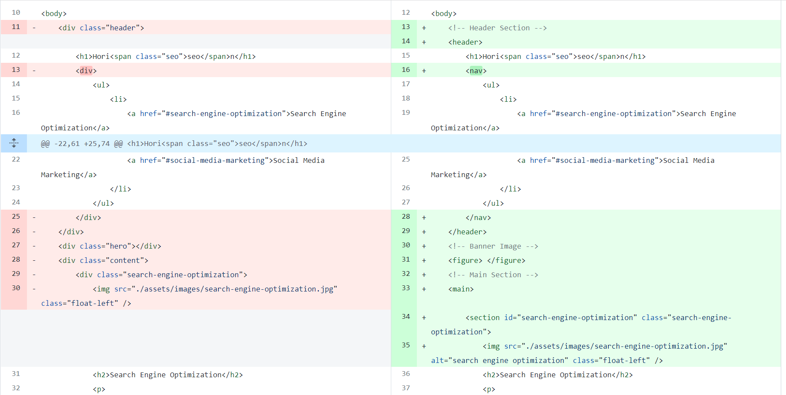

# Refactored Horiseon Landing Page

## Description
- This code Updates the Horiseon landing page by Refactoring to display symantic HTML element styling and concise code.
- By completed this exercise I learnt the importance of developing code that is easy to read and change for future development.

## Expectations
- You will find..
    - Semantic HTML elements
    - Elements follow a logical structure independent of styling and positioning
    - Find accessible alt attributes
    - Header attributes fall in sequential order
    - Find a concise, descriptive title

## Table of Contents
- [Installation](#installation)
- [Changes Log](#changes-log)
- [Credits](#credits)

## Changes Log
- Semantic HTML elements
    - ex: I changed divs with classes that represent what they are doing to its shortest form.
        - 

        - <header></header>
- Elements follow a logical structure independent of styling and positioning
    - elements are listed in order
        - head
        - body
        - header
        - nav
        - ect..
- Find accessible alt attributes
    - I added alt tags to all images

- Header attributes fall in sequential order
    - h1
    - nav
    - ul
    - li
    - a

- Add ID tag to help improve SEO acceibility 
    - This helped jump to a specific section of page when clicked    

## References
- Github Pages
https://altheahanson.github.io/refactoring/

- Semantic Elements
https://www.w3schools.com/html/html5_semantic_elements.asp

